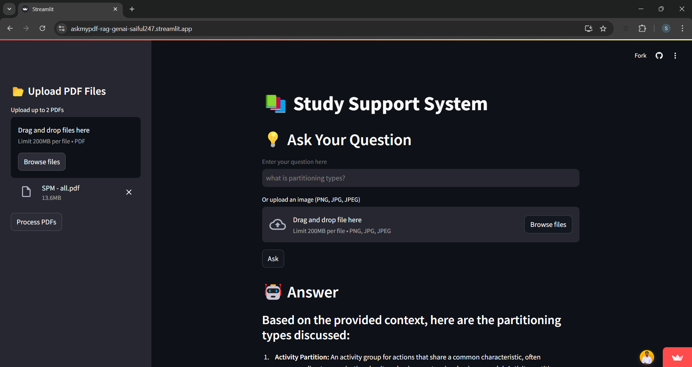
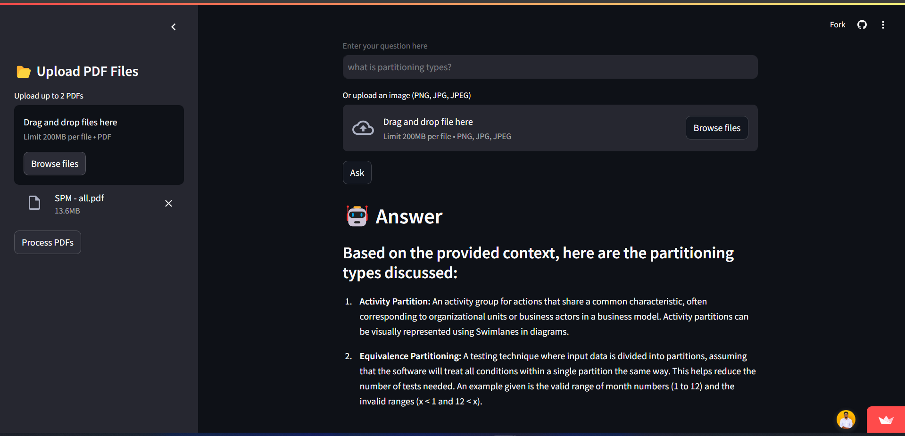
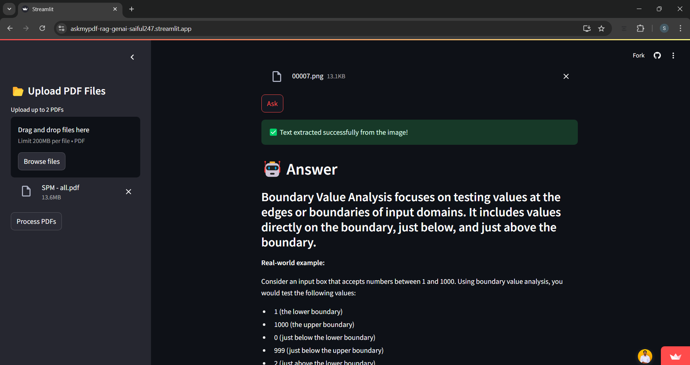

# 📚 AI-Powered RAG Chatbot for PDF & Image-Based Q&A

🚀 **Built for SLIIT students & beyond!** This **Retrieval-Augmented Generation (RAG) chatbot** allows users to upload PDFs and ask AI-powered questions while ensuring answers are **aligned with their specific documents**.

---

## 📌 Why This Project?

During **SLIIT semester exams**, students face a major challenge: **too many PDFs** (lecture notes, past papers, textbooks) and **inconsistent answers from AI tools** like ChatGPT.

💡 The problem? **University-specific content & approaches are different** from generic AI responses.

✅ **Solution:** This chatbot **retrieves answers directly from your uploaded PDFs**, ensuring **context-aware** and **accurate** responses for study modules.

✅ **Beyond education:** Businesses & professionals can use it to query **private documents** (e.g., legal, financial, and policy documents) without exposing sensitive data to external AI models.

---

## 🔑 Features

✔ **Multi-PDF Upload** 📂 – Upload multiple PDFs and get AI-driven responses based on their content.  
✔ **Image-Based Text Extraction (OCR)** 📸 – Upload images (PNG, JPG, JPEG), and the chatbot extracts text using **Google Vision API**.  
✔ **RAG (Retrieval-Augmented Generation)** 🔎 – AI retrieves answers directly from PDFs for **contextually accurate responses**.  
✔ **FAISS Vector Search** ⚡ – Fast & efficient document retrieval.  
✔ **Google Gemini AI for Q&A** 🤖 – Uses `gemini-2.0-flash` for smart answers.  
✔ **Secure Data Handling** 🔐 – Data remains private; no external sharing.  
✔ **Easy-to-Use Interface** 🎨 – Powered by **Streamlit** for an interactive experience.

---

## 🛠 Tech Stack

- **Backend:** Python, LangChain, FAISS
- **Vector Search:** FAISS (Fast Approximate Nearest Neighbors)
- **OCR Processing:** Google Vision API (Extracts text from images)
- **Embeddings:** `GoogleGenerativeAIEmbeddings(model="models/embedding-001")`
- **LLM Model:** Google Gemini (`gemini-2.0-flash`)
- **Frontend:** Streamlit
- **Deployment:** Streamlit Cloud

---

## 🚀 How It Works?

1️⃣ **Upload PDFs** → Process them for retrieval.  
2️⃣ **Ask Questions** → Type a question OR upload an image containing text.  
3️⃣ **AI Answers** → The chatbot retrieves relevant info from PDFs/images and responds accurately.

---

## 🔐 Security & Use Cases

- **For Students:** Upload **university PDFs** & get AI-powered responses tailored to your syllabus.
- **For Businesses:** Keep **internal documents private** while enabling AI-powered search (HR policies, legal docs, financial reports).
- **For Professionals:** Extract & retrieve insights from **technical manuals, compliance guidelines, or research papers** securely.

> **Why not use ChatGPT for this?** Because **most company data is private**, and generic AI cannot access or answer based on **your internal documents**. This chatbot keeps everything **secure** while enabling **intelligent document search**.

[Visit App](https://askmypdf-rag-genai-saiful247.streamlit.app/)
